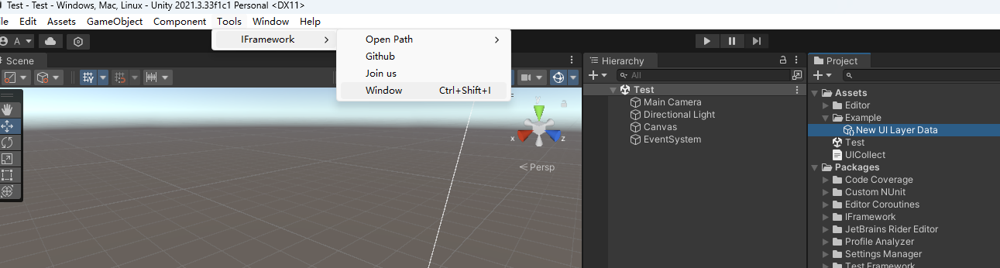
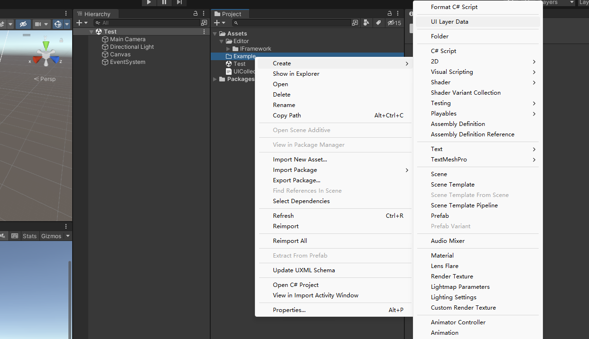
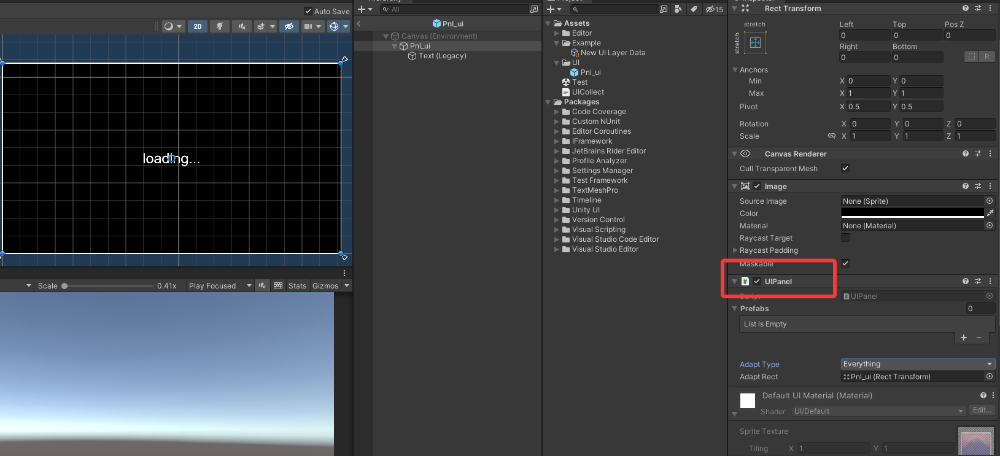
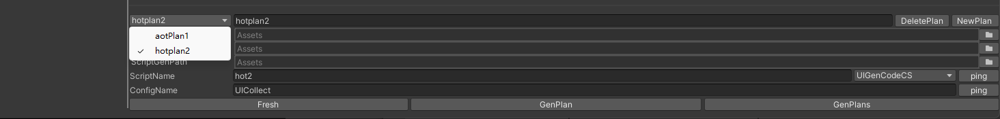
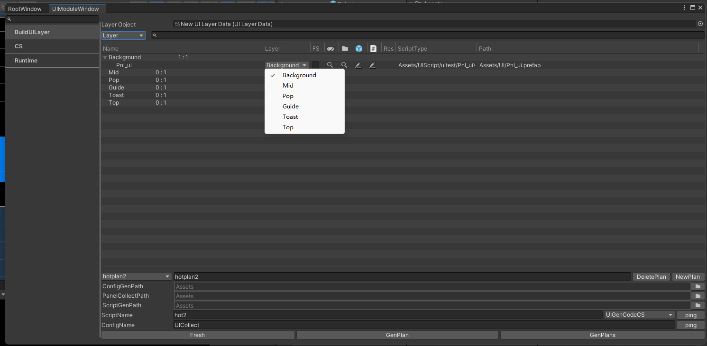
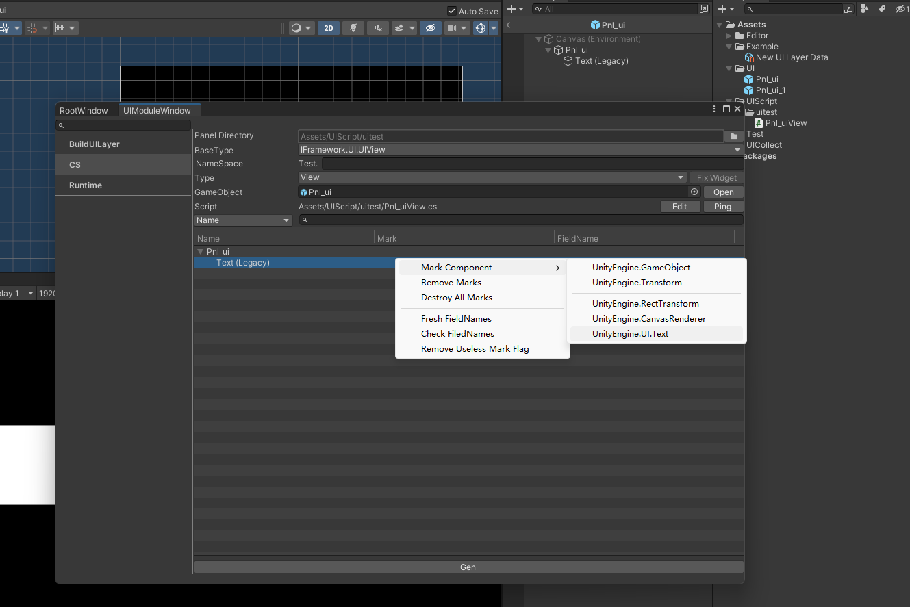
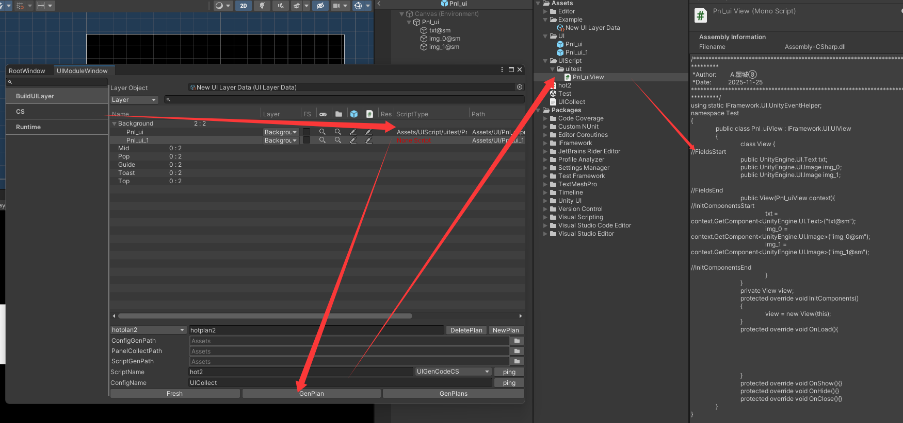
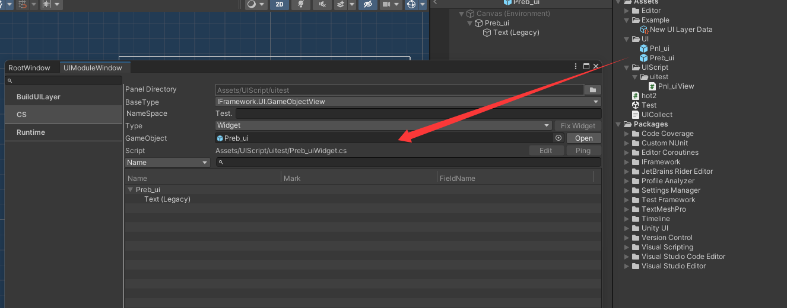
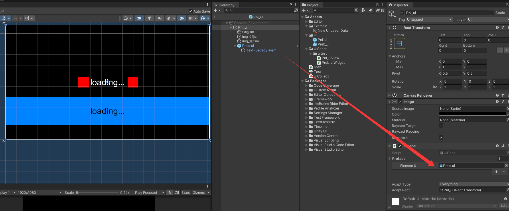

# UI 编辑器工作流

## 打开窗口

菜单：

```text
Tools > IFramework > Window
```

快捷键：

```text
Ctrl/Cmd + Shift + I
```

RootWindow 会发现内置 Tab 和通过 EditorWindowCache 注册的窗口。UI 主要使用 `UI/Module`、`UI/CS` 等页签，具体名称以当前窗口树为准。



## 完整流程

```text
创建 UILayerData
-> 创建 UIPanel Prefab
-> 建立 PanelCollection Plan
-> 收集 Prefab 和设置 layer/fullScreen
-> 标记需要生成的组件字段
-> 生成 UIView/Widget 代码
-> 生成 PanelCollection JSON 和 path/type map
-> Runtime UseUI
```

## 1. 创建层级资产

```text
Create > IFramework > UILayerData
```

根据项目调整层级列表。列表越靠后，显示优先级越高。



在 UI 模块窗口把该资产设置为 Layer Object。

## 2. 创建 UIPanel Prefab

1. 创建 Canvas 下的面板根节点。
2. 添加 `UIPanel`。
3. 设置安全区 Adapt Type/Adapt Rect。
4. 保存为 Prefab。
5. 确认收集 Plan 的 Panel Collect Path 能扫描到它。



编辑器添加 UIPanel 时会尝试选择一个全拉伸子 RectTransform 作为 adaptRect；没有合适子节点时使用自身 RectTransform。

## 3. PanelCollection Plan

Plan 字段：

| 字段 | 用途 |
| --- | --- |
| `name` | 方案名，可按模块/团队拆分 |
| `Panel Collect Path` | 扫描带 UIPanel 的 Prefab 根目录 |
| `Config Gen Path` | PanelCollection JSON 输出目录 |
| `Config Name` | JSON 文件名 |
| `Script Gen Path` | path/type map 脚本输出目录 |
| `Script Name` | map 类名 |
| `typeIndex` | 选择 UIGenCode 实现 |

至少保留一个 Plan。可以为 AOT、Hotfix 或不同业务模块建立独立方案，避免多人生成互相覆盖。



## 4. 收集界面

收集器通过：

```csharp
AssetDatabase.FindAssets("t:prefab", new[] { PanelCollectPath })
```

筛选带 UIPanel 的 Prefab。

刷新时：

- 删除已经不存在的 path。
- 添加新 Prefab。
- Resources 路径会去掉 `Resources/` 前缀和 `.prefab`。
- 默认 layer = 0、fullScreen = false。
- 按生成的合法名称排序。

界面列表中为每个 Panel 设置：

- Layer。
- FS（fullScreen）。
- 检查 Prefab、脚本和 path。



## 5. 标记组件

把 Prefab 拖入 CS 页签后，层级节点可以执行：

- `Mark Component`：选择要导出的组件类型。
- `Remove Marks`：删除当前标记。
- `Remove All Marks`：删除全部标记。
- `Fresh FieldNames`：根据节点名刷新字段名。
- `Check FieldNames`：处理重复字段名。
- `Remove Useless Mark Flag`：清理已删除对象残留。



标记信息保存在 UIPanel 或内部 ScriptCreatorContext：

```csharp
public class MarkContext
{
    public GameObject gameObject;
    public string fieldName;
    public string fieldType;
}
```

字段名必须符合 C# 标识符规则。生成器会把空格替换为下划线、移除非法字符、数字开头时补 `_`。

## 6. 生成 UIView

选择：

- Panel Directory：脚本输出目录。
- BaseType：通常 `IFramework.UI.UIView` 或项目 ViewBase。
- Namespace。
- Type = `View`。
- GameObject = UIPanel Prefab。

点击 Gen 后生成结构：

```csharp
public sealed class LoginView : UIView
{
    private sealed class View
    {
        public Button Login;

        public View(LoginView context)
        {
            Login = context.GetComponent<Button>("Login@sm");
        }
    }

    private View view;

    protected override void InitComponents()
    {
        view = new View(this);
    }

    protected override void OnLoad() { }
    protected override void OnShow() { }
    protected override void OnHide() { }
    protected override void OnClose() { }
}
```

生成器使用 `FieldsStart/FieldsEnd` 和 `InitComponentsStart/End` 标记更新字段区域。业务逻辑应写在标记区域之外。



## 7. 生成 Widget

Widget Prefab 不需要 UIPanel。代码生成后会添加内部 ScriptCreatorContext 保存 marks/prefabs。

选择 Type = `Widget`，BaseType 通常为 `WidgetView` 或项目 WidgetBase。



生成的 Widget 通过 UIView/父 Widget 创建：

```csharp
var pool = CreateWidgetPool<ItemWidget>(prefab, parent);
ItemWidget item = pool.Get();
```

## 8. Prefabs 引用

UIPanel/ScriptCreatorContext 的 `Prefabs` 列表用于嵌套 Widget。生成代码会按 GameObject.name 调用：

```csharp
context.FindPrefab("ItemWidget")
```

同一个 Context 内 Prefab name 应唯一。重命名 Prefab 后重新生成。



## 9. 生成配置和 map

操作：

- `Fresh`：刷新当前方案和脚本状态。
- `GenPlan`：生成当前方案。
- `GenPlans`：生成所有方案。

输出包括：

1. PanelCollection JSON。
2. Panel path 常量。
3. `Dictionary<string, Type>` 的 View map。

示例：

```csharp
public static class PanelNames
{
    public const string Login = "UI/LoginPanel";

    public static readonly Dictionary<string, Type> map = new()
    {
        [Login] = typeof(LoginView)
    };
}
```

Runtime 把 JSON 传给 `PanelCollection`，map 传给 `ViewBridge`。

## 10. 多方案

推荐按代码所有权拆分：

```text
CoreUI
BattleUI
ActivityUI
HotfixUI
```

每个 Plan 使用独立：

- 扫描目录。
- ConfigName。
- ScriptName。
- 输出路径。

Runtime 可以合并多个 map：

```csharp
new ViewBridge(CorePanels.map, BattlePanels.map, ActivityPanels.map)
```

PanelCollection 也可以在业务构建阶段合并，但 path 必须唯一。

## 11. 自动 UI 优化

IFramework Editor 监听组件添加并应用默认设置：

- Text：关闭 raycastTarget、richText、bestFit。
- Image/RawImage：关闭 raycastTarget。
- Button/InputField/Dropdown 等：重新开启目标 Graphic raycast。
- ScrollRect：尝试把 Mask 换为 RectMask2D，并移除多余 Graphic。
- UIPanel：自动选择 adaptRect。

这些是性能倾向默认值，不一定适合所有 Prefab。添加组件后检查交互需求，必要时手动调整。

右键 Text/Image/RawImage 等组件的 `Remove Component` 会同时移除 CanvasRenderer，适合清理纯布局节点，但执行前确认没有其他 Graphic 依赖。

## 12. 多边形 Raycast

Image 右键：

```text
Replace To PolygonRaycastImage
```

`PolygonRaycastImage` 和 `Empty4Raycast` 支持编辑多边形点，使用点在多边形算法过滤点击。

`ImagePolygonMeshEffect` 根据 Sprite mesh 重建 UI mesh，仅适用于 Image.Type.Simple。Sprite 只有普通两个三角形时不会重建。

## 13. 运行时调试

Play Mode 打开 IFramework Window，可查看：

- UI 模块列表。
- 当前 Canvas 层级。
- 每层 top / top show。
- 全局 top show。
- visible 列表。

双击层级项可定位对象，便于排查全屏遮挡和排序。

## 14. 生成代码版本控制

- JSON、path 常量和 View 脚本应提交 Git。
- 生成前先同步同一模块最新版本。
- 业务代码不要写进生成标记块。
- Review 中同时检查 Prefab、JSON 和 map 变化。
- CI 可增加“重新生成后 git diff 为空”的一致性检查。

## 常见问题

### Prefab 不出现在列表

检查扫描目录、Prefab 根是否有 UIPanel、AssetDatabase 是否刷新。

### ScriptType 红色

View 未生成、类名/命名空间不匹配，或 map 没刷新。

### 字段找不到

Prefab 节点路径改变后重新 Fresh/Gen；确认标记仍指向有效对象。

### path 不一致

Resources path 和 AssetDatabase path 的处理不同。以生成的常量为唯一调用入口。

### 多人冲突

按模块拆 Plan 和输出文件，避免所有 UI 共用一个 map/JSON。
