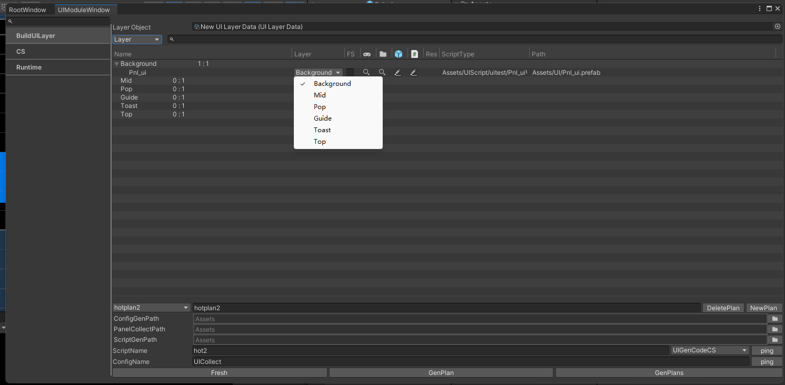
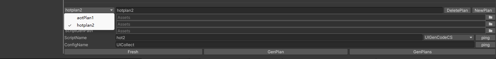
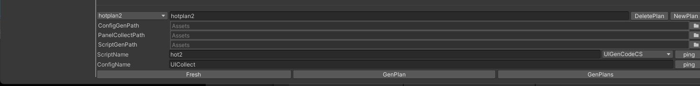

# BuildUIlLayer操作面板介绍
## 开发人员可以通过这个面板，对Ui配置方案编辑，对界面配置，查找等操作。

>* **Layer Object ：** 拖入项目中设置好的层级数据.
>* **Layer ：** 查询方式 1.层级可视化查看（当前默认）2.文件夹查看
>* **Name ：**  UI层级 **（注 ：在自己UI Layer Data 中查看自己配置的层级）**。
>* **Layer/background-/Mid...... ：** 可更改UI所在层级（根据需求）
>* **FS ：** 勾选这个会对这个界面下的其他界面会被隐藏，减少多个界面一起渲染。
>* **游戏机图标 ：** 在运行模式下定位UI位置。
>* **文件夹图标 ：** 定位项目中预制体位置。
>* **预制体图标 ：** 编辑预制体。
>* **脚本图标 ：** 编辑脚本。
>* **ScriptType ：** 脚本路径。
>* **Path ：** 预制体路径。
>* 

>* **aot/hot ：** UI收集器方案。（例 ：装备系统/养成系统由不同开发者开发防止出现，导出代码互相覆盖顶替，可以起两套方法互不打扰，这里随便以aot 和 hot 为例子）。**（aot/hot 均为自定义名字）**
>* **Delete plan ：** 删除方案。
>* **New plan ：** 增加方案。
>* **Config Gen Path ：** UI配置生成路径，用来保存方案配置。（点击右侧可更改路径）
>* **Panel Collect Path ：** 界面收集器路径。（点击右侧可更改路径）
>* **Script Gen Path ：** 脚本生成路径，此脚本用来收集UI预制体项目路径。（点击右侧可更改路径）
>* **Script Name ：** 自定义脚本名字。（例 ：起名hot 导出后会自动生成命为hot.cs 的脚本）
>* **Config Name ：** UI配置命名。（例 ：起名UICollect 导出后会生成名为UICollect 的json文件）
>* **Fresh：** 刷新脚本。
>* **Genplan：** 生成脚本用来搜集UI预制体路径。（这里我面点击Genplan如图所示）
>* **Genplans：** 生成所有搜集UI预制体路径。

>* 
>* 

