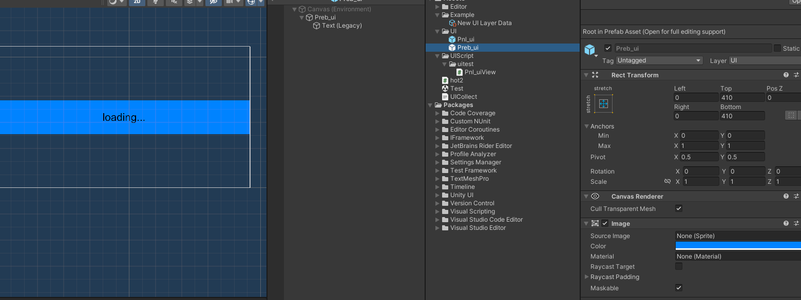
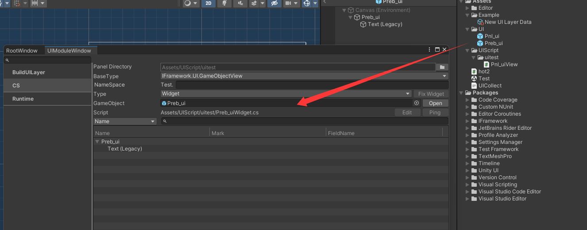
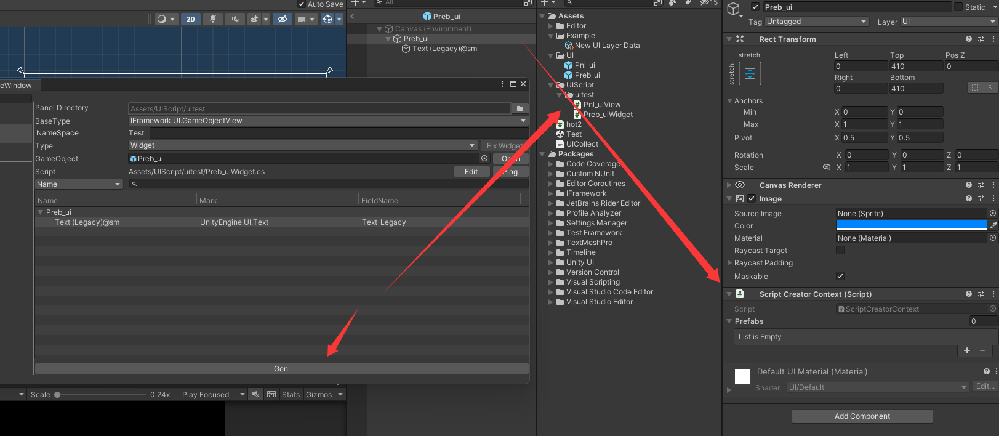
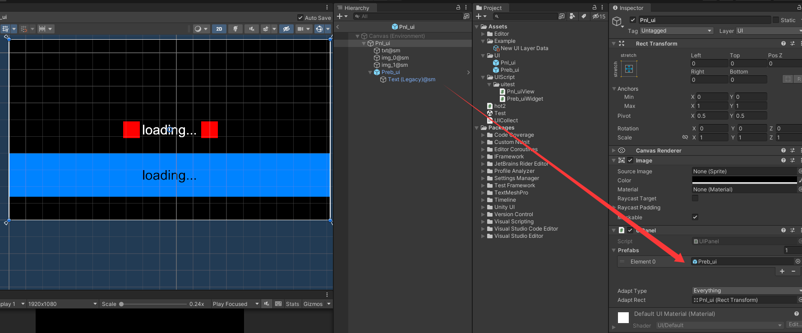
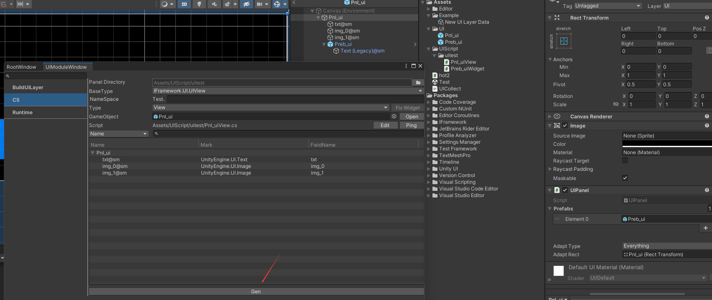
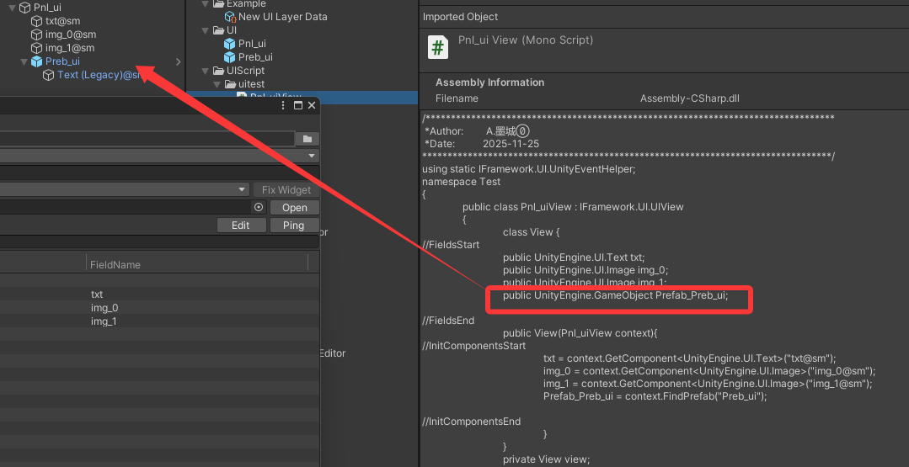

# UIWidget 组件使用教程
## 1.创捷UIWidget预制体 
>* 

## 2. 操作Widget所需对象
>* widget 不 涉及到 ui 操作直接打开操作面板进入CS页签 （在上篇中已经简单介绍过了这里不再重复叙述）
>* 将Preb拖拽至 GameObject **(注 ：拖入后 Yype 会自动 修改类型 改为 Widget ,如果未修改可以手动修改类型)**
>* 

>* 重复之前操作选中mark类型点击gen生成，成功后如图所展示。
>* Gen生成之后，会出现 ****Widget 脚本。
>* Widget 预制体会自动挂载 **Script Creator Context** 脚本
>* **Prefabs：** 挂载其他Widget，实现UI中根据需求，需要多层组件镶嵌使用的情况。

>* 

## 3.UI上 使用 Widget 组件 （例 ：）
>* 在Pnl 上需要使用 Preb 组件 在 Prebfas 上挂载Preb （如图）
>* 重新打开Cs 组件不会显示在面板中，直接点击Gen导出代码，会在代码中增加，Preb 组件的对象。
>* 
>* 
>* 