# UI界面使用教程
## 1.创捷uipanel预制体，挂载Uipanel脚本
>* **UIPanel.cs ：** 用来标记UI界面脚本，会被配置面板 UIModule 检测到。
>* **Prefabs ：** 放入UIWight组件，导出代码时会增加与之对应的数据对象。
>* **Adapt Type ：** 刘海屏适配类型，根据不同得机型进行适配 **（everything_上下左右都进行适配；Top_上适配；Left_左适配；Right_右适配；Bottom_下适配）**
>* **Adapt Rect ：** 适配对象（自己）注：引用其他UI对象，无法对自己进行界面适配

>* 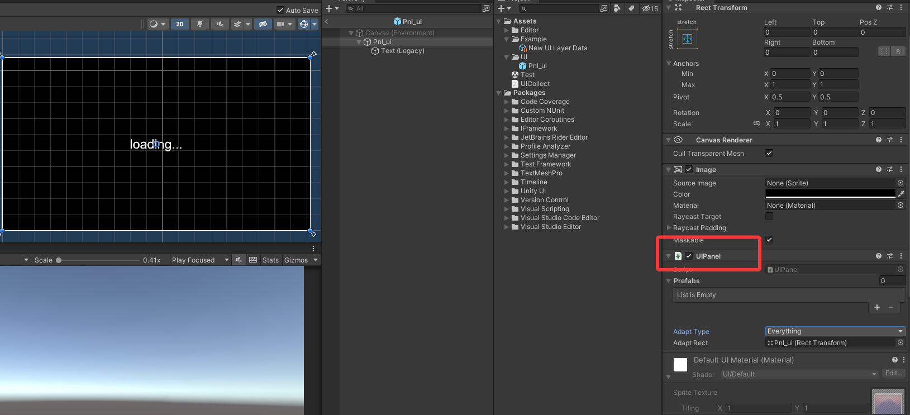

## 2.运用 UIModuleWindow
>* 当我们创建好预制体后，打开 UIModule 界面 **（Tools -> IFramework -> Window ( Ctrl+Shift+I )）** / BuildUIlayer 会自动检测到UIpanel 预制体（界面）当我们预制体没有脚本得时候，scriptType 显示红色状态 （当前预制体没有对应脚本）

>* 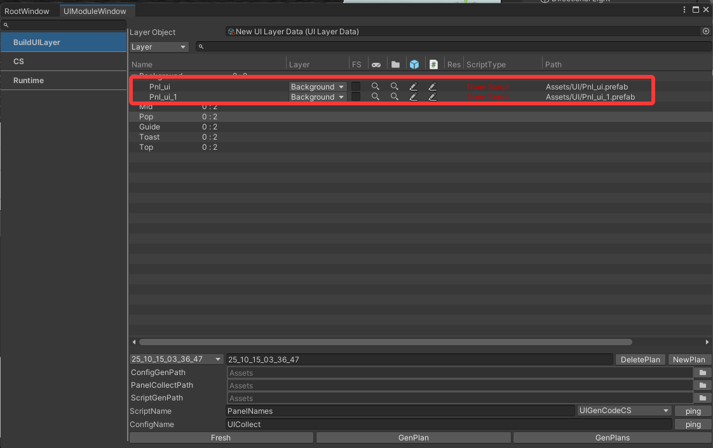

## 3. UI脚本对象配置以及简单介绍
>* 鼠标点击切换到CS页签 如图展示（当前展示部分操作完成后得结果）
>* **生成脚本会简单介绍一下，需要的步骤操作，后续会单独介绍模块功能**
>* **(1). Panel Directory：** 默认为空路径（代码生成路径）。  例 ：在项目中创建UI文件夹和uitest子文件夹拖入其中，可依据跟不同任务ui模块分配不同得生成代码文件夹路径。
>* **(2). BaseType：** 脚本继承得是 IFramework.UI.UIView (默认不管)
>* **(3). Test：** 可配置生成脚本命名空间（Test 可更改，这里暂且默认不管）
>* **(4). Type：** 在框架中会对 **UI** 和 **Widget** 组件进行不同得类型管理。当前UI界面选择 **View** 类型
>* **(5). GameObject：** 预制体对象 **这里我们拖入Pnl_ui预制体**
>* **(6). Name：** 可根据名字，类型，等查找对象（接下来介绍）
>* **(7). 操作区：** 如图红框所示当我们拖入预制体后会自动刷新展示预制体及需要导出子对象信息
>* 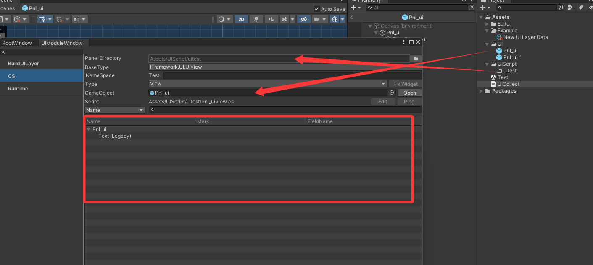

## 4. 操作UI所需对象
>* 右键你想导出得对象会出现选项框如图所示
>* **(1). Mark Component：** 标记对象可以选择文本或者对象或者其他你需要的。**（注：成功标记可以在预制体上看到 @sm 标记）**。
>* **(2). Remove Marks：** 移除标记。
>* **(3). Remove All Marks：** 移除全部标记。
>* **(4). Fresh FieldNames：** 当你预制体其中对象改名字时候可以点击刷新。**（注 ：快捷方法，当任何对象增加，删除，修改名字，等等可以点击最上层Pnl_ui左面小箭头关闭重新打开就会自动刷新）**

>* 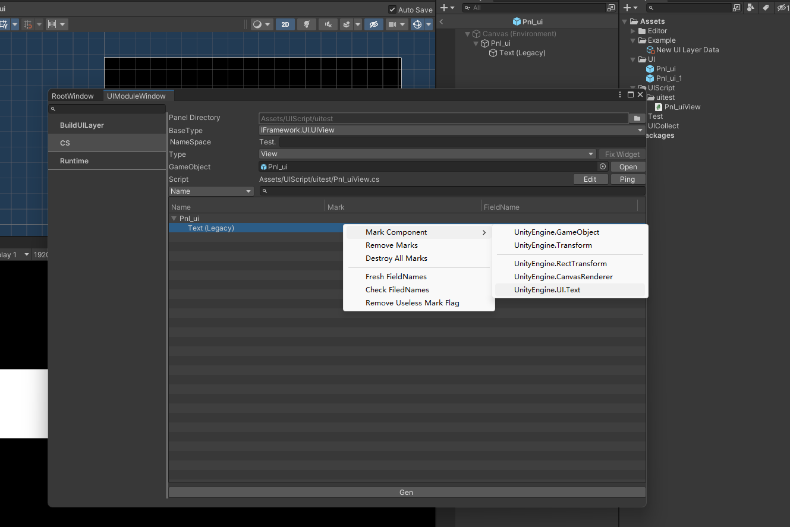
>* 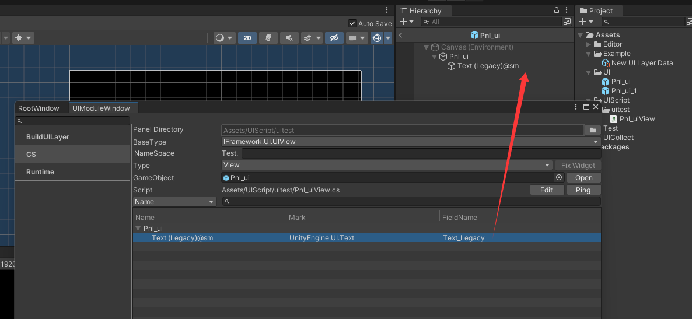

>* **(5).  Check FieldNames：** 出现相同命名组件时，选中两个对象进行check 检查。会自动在名字后增加指示标记。对命名不满意时，单独点击FieldName 下的命名对象，进行自定义。
>* **(6). Remove Useless Mark Flag：** 对一些已经删除得对象，这个可以删除一些不必要的引用。**（在导出代码时候，会重新识别 看需求使用）**

>* 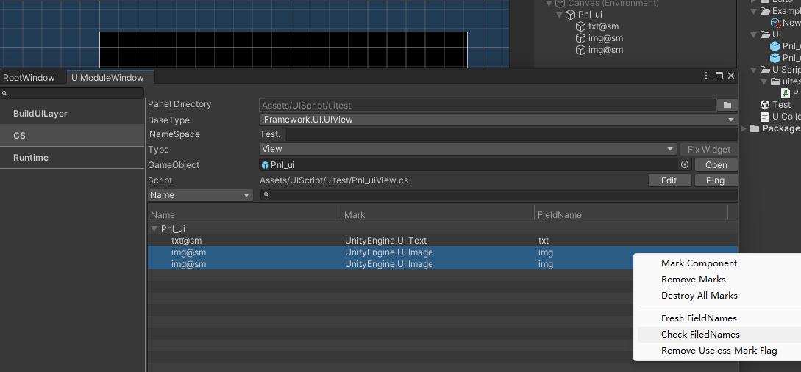
>* 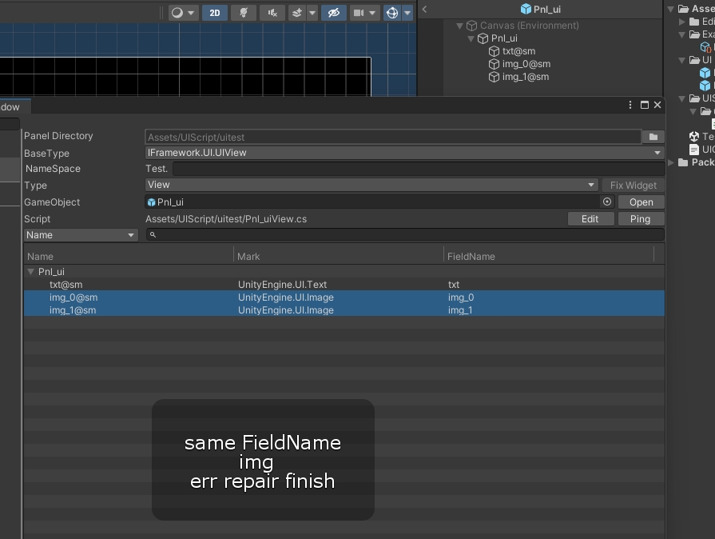
>* 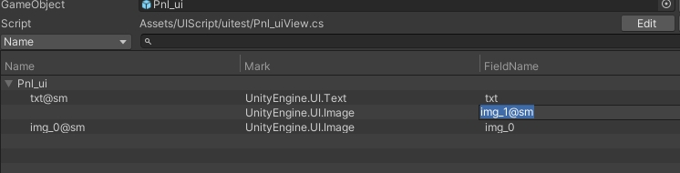

## 5. 导出代码/导出UI路径数据/UI收集器更新层级数据
>* **配置好数据对象后，点击Gen：** 如图所示。
>* **BuildUILayer 页签：** 点击gen 生成后 界面 scriptType 显示脚本名称和位置。

>* **Fresh：** 刷新脚本。
>* **Genplan：** 生成脚本用来搜集UI预制体路径。（这里我面点击Genplan如图所示）
>* **Genplans：** 生成所有搜集UI预制体路径。

>* 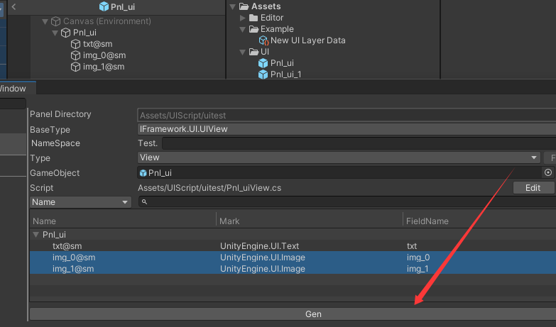
>* 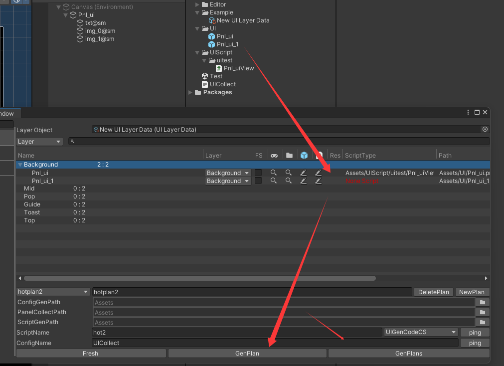
>* 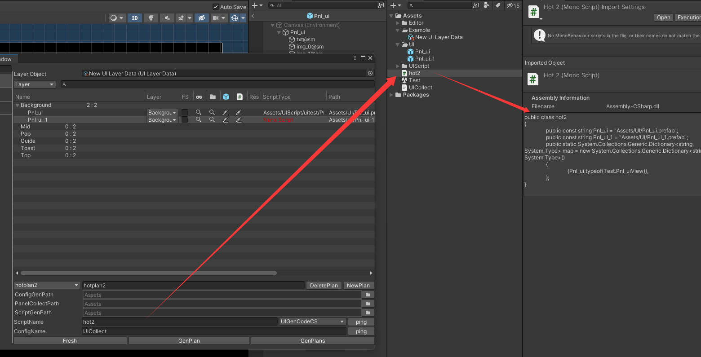

## 6.结果查看
>* 当项目中 有所需脚本，UI收集器，和路径脚本有数据的时候说明我们UI界面生成功。
>* 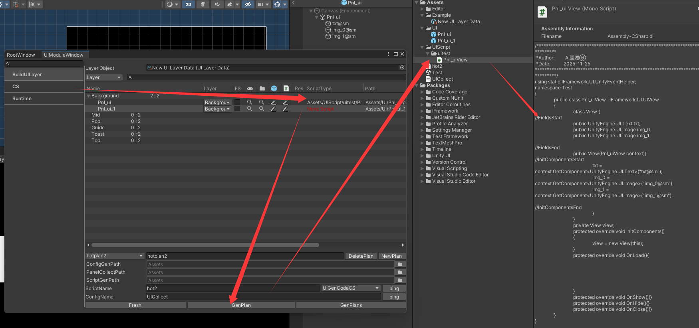