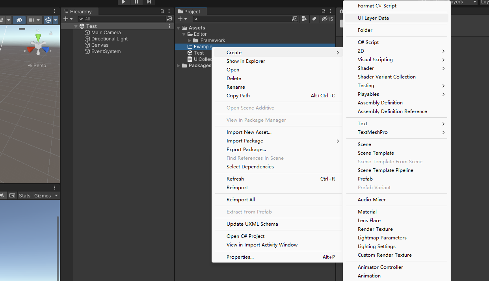
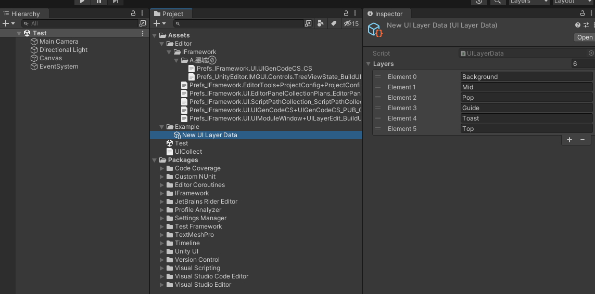
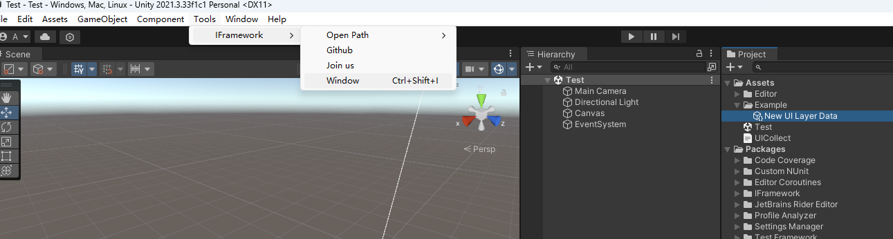
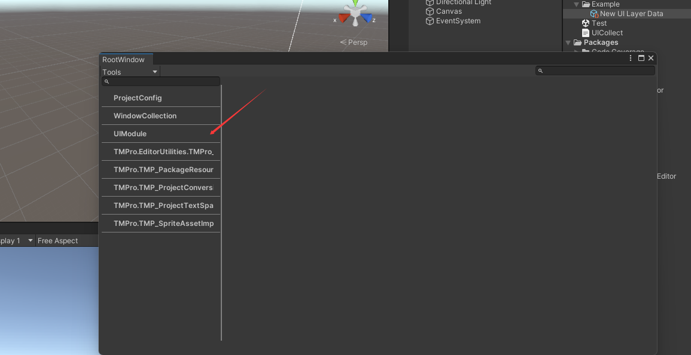
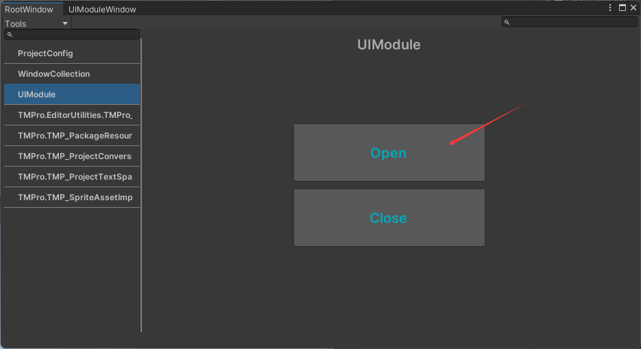
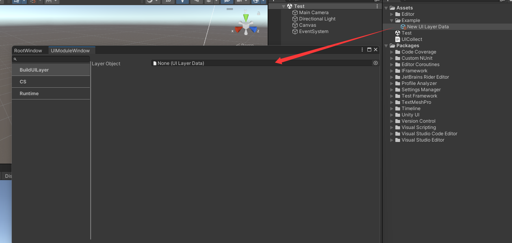
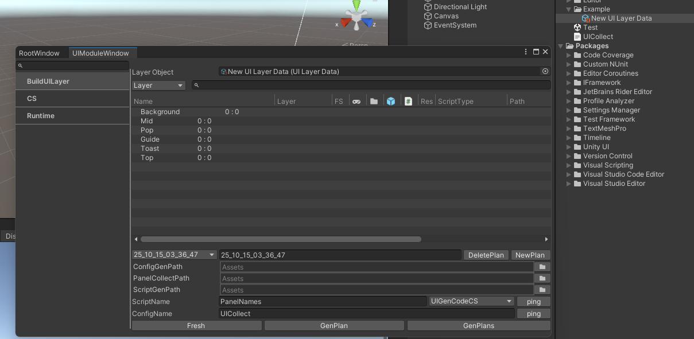

## 1.创建 UILayerData - Scriptableobject数据容器
>* 
## 2.Layers介绍
>* layers UI层级设计，可以根据项目需求编辑Layers数量层级数据。默认层级 **（Background_底层；Mid_中；Pop_弹窗；Guide_新手教程等；Toast_次高级弹窗；Top_最高等级）**

>* 
## 3.打开UI配置面板 UIModule
>* Tools -> IFramework -> Window ( Ctrl+Shift+I )

>* 
>* 
## 4.将生成得 UILayerData 拖入 LayerObject

>* 
>* 
>* 
## **以上基础配置完成**